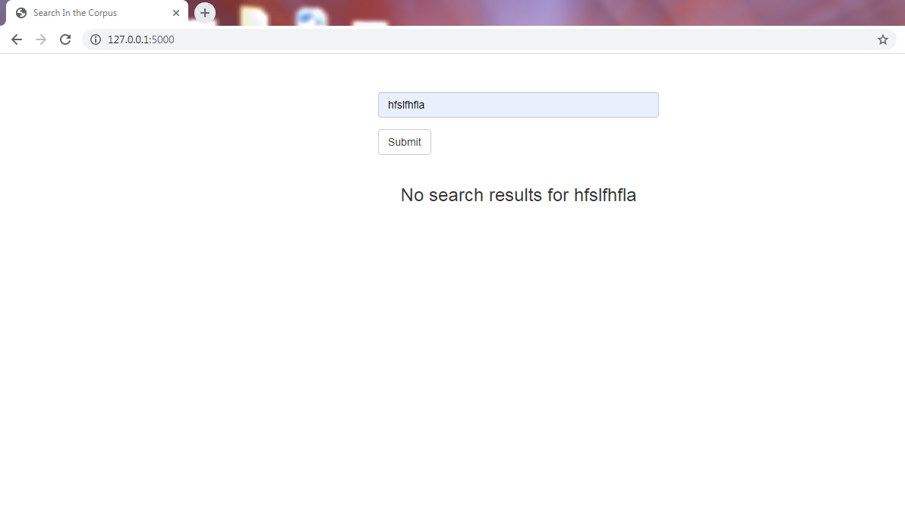

# Search Engine

## Description
In this project we have implemented a search engine over the corpus of 
all UCI ICS web pages. 

## Design Approach
The search engine has 3 main components:

- **Indexer**: This generates an inverted index of words pointing to
           a string of [documentId, position]. To create the inverted index,
           we have considered all alphanumeric sequences in the data set as
           tokens. Also, we have retained all stop words, and have used stemming
           for better textual matches. While creating the scores, we have 
           assigned different weights to titles, headers and bold. We initially 
           created many small inverted indexes , and then merged them into a single index 
           in a multi-threaded manner. We repeated this process for one-grams, 
           two-grams, and three-grams.   
- **IndexHasher**: To improve the speed in which query results are retrieved,
           we hash our index files and serialize them into smaller files. These 
           files are hashed based on the first letter of the token followed by a 
           range bucket for the next four letters as follows:
             
           " " to "d" is encoded as 1\
           "e" to "l" is encoded as 2\
           "m" to "r" is encoded as 3\
           "s" to "z" is encoded as 4
           
- **Search**: This takes in the input search query, processes the terms, retrieves the 
           relevant pages and performs score calculation. The pages are then 
           ranked by these scores and are displayed.

## Demo

The web app displays the search query, time taken for search (in seconds),
and search result pages.

- **Search Query: "Machine"**

  
- **Search Query: "Computer Science"**

  
- **Search Query: "Masters in Software Engineering"**

  
- **Search Query: "hfslfhfla"**

  

## Requirements

- Python3
- NLTK
- BeautifulSoup
- Flask

## Authors

 This project was done by Sai Prameela Konduru, Arkadeep Adhikari 
 and Sri Krishna Priya Dhulipala.
